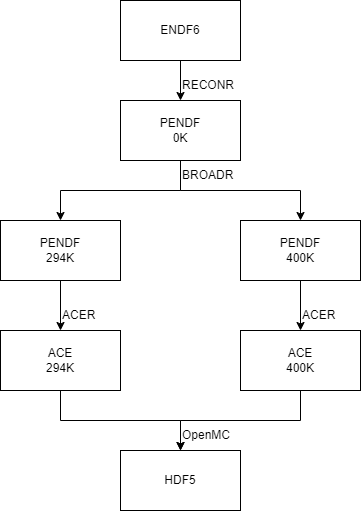

.. _ndsampler:

=========
NDSampler
=========

The purpose of NDSampler is to encapsulate calls to the `NJOY <https://github.com/njoy/NJOY2016>`_ nuclear data processing code and the `Sandy <https://github.com/luca-fiorito-11/sandy>`_ nuclear data sampling library to generate perturbed nuclear data usable for OpenMC calculations.

The following figure shows a simplified diagram of how a ENDF6 tape becomes an processed nuclear data file usable by OpenMC.

   The nuclear data processing pipeline with NJOY

Perturbation can be applied at different stages of this process to generate perturbed nuclear data files:

* The perturbation can be applied directly on the ENDF6 file. In this case the perturbation will be propagated through both RECONR and BROADR. This also allows for the perturbation of MF2 and MF3 separately. To generate :math:`n` samples for :math:`n_t` temperatures this method requires

  * :math:`n` RECONR runs
  * :math:`n \times n_t` BROADR runs

* The perturbation can be applied on the 0K PENDF file. In this case the perturbation will be propagated through BROADR only. Covariance matrices that combine MF32 and MF33 covariance data can be computed using ERRORR. To generate :math:`n` samples for :math:`n_t` temperatures this method requires

  * :math:`n \times n_t` BROADR runs

* The perturbation can be applied on the final HDF5 file. In this case the perturbation will not be propagated at all through the processing pipeline. This method requires no NJOY run at all.

The NDSampler module implements the second method using Sandy as a sampling tool and NJOY wrapper, and the third one using it as a sampling tool only. 
These correspond to the ``nds pendf`` and ``nds hdf5`` commands.

The PENDF method requires only access to the correct ENDF6 tapes, covariance matrix are then generated using ERRORR.
For the HFD5 method, NDSampler uses a custom covariance matrix format written to disk and loaded directly when sampling.
This eliminates the need for NJOY runs when sampling on HDF5 files.

To generate these covariances matrix, NDSampler provides the ``nds cov`` command.

.. toctree::
    :maxdepth: 2

    nds_cli
    storage
    python
